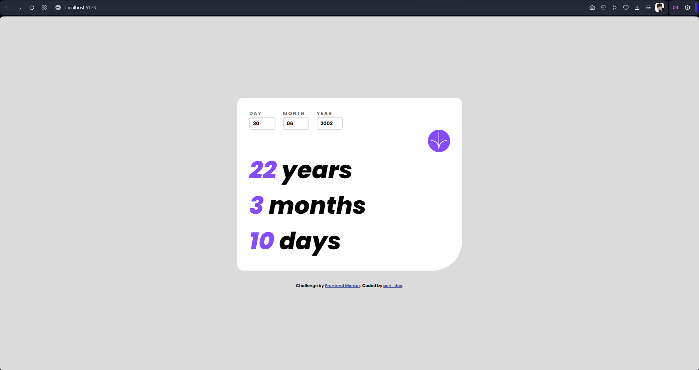

# Frontend Mentor - Age calculator app solution

This is a solution to the [Age calculator app challenge on Frontend Mentor](https://www.frontendmentor.io/challenges/age-calculator-app-dF9DFFpj-Q). Frontend Mentor challenges help you improve your coding skills by building realistic projects. 

## Table of contents

- [Overview](#overview)
  - [The challenge](#the-challenge)
  - [Screenshot](#screenshot)
  - [Links](#links)
- [My process](#my-process)
  - [Built with](#built-with)
  - [What I learned](#what-i-learned)
  - [Continued development](#continued-development)
- [Author](#author)

## Overview

### The challenge

Users should be able to:

- View an age in years, months, and days after submitting a valid date through the form
- Receive validation errors if:
  - Any field is empty when the form is submitted
  - The day number is not between 1-31
  - The month number is not between 1-12
  - The year is in the future
  - The date is invalid e.g. 31/04/1991 (there are 30 days in April)
- View the optimal layout for the interface depending on their device's screen size
- See hover and focus states for all interactive elements on the page
- **Bonus**: See the age numbers animate to their final number when the form is submitted

### Screenshot

### Links

- Live Site URL:[(https://ash-dev-age-calculator.vercel.app)]

## My process

- The first thing I did was to set up the HTML markup of the project. I re-group the components to different DIV elements and added class names. I also identified the key elements that I will need to access using Javascript later on. I then proceed to writing the styles in CSS. I also took note on the hover states of interactive elements like the input and the button. Then I moved on to writing the functionality of the project. I first declared the variables needed that will store the HTML elements I needed to access. Then I wrote the function for validation of input. I struggled on this part as I don't want to write a repetitive code and the day should match the correct number of each month. After writing the validation, I proceeded to write the fuction for calculating the date for age. While I was writing this section, I started to get dissatisfied by the way I was structuring my javascript. Then I thought of a more efficient way which was to wrap the input values and error elements at once and call them when it is needed on the calculateDate() fuction and validateInput(). After that I added a counting up animation to the results.

### Built with

- Semantic HTML5 markup
- CSS custom properties
- Flexbox
- Desktop-first workflow
- Javascript algorithm and animation

### What I learned

- My most valuable takeaway from this project was the experience of writing my own algorithm for calculating the age and the validation methods. It has challenge my logical thinking on how I should implement the functions with my HTML content.

### Continued development

-I would like to add a dark mode theme switcher for this to make it more complex and appealing to different user preferences. 

## Author

- Facebook - [@trishacapitle01](https://www.facebook.com/trishacapitle01/)

